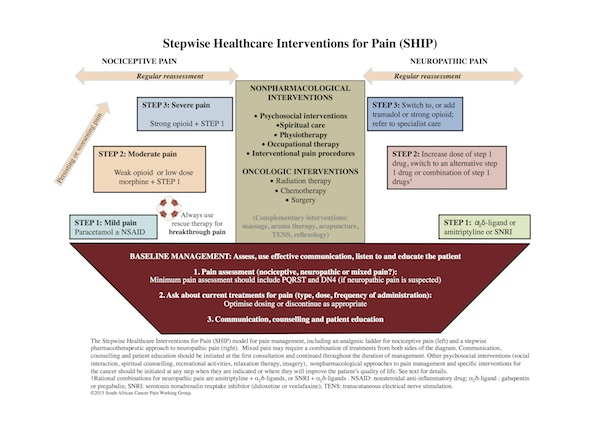

 

The first South African guideline for the management of cancer pain was published yesterday, and is available at [figshare.com](http://figshare.com/articles/Guide_to_treatment_of_cancer_pain_in_South_Africa/1612170).
<!--read more-->
While palliation of cancer pain is being increasingly taught in South African medical schools, there is still a significant deficit in knowledge and experience on how to approach the assessment and management of pain in people with cancer. These deficits are magnified when it comes to managing children with cancer pain.

To provide a reference guide for healthcare professionals involved in the care of people with cancer pain, the Pain Society of South Africa ([PainSA](http://www.painsa.org)) and the Hospice Palliative Care Association ([HPCA](http://www.hpca.co.za)) of South Africa brought together a panel of experts to review international best practice, and to adapt these practices for local conditions. Because cancer pain in children is an often neglected, they also included a dedicated section on the assessment and management of paediatric cancer pain.

The leader of the project, Dr Charmaine Blanchard, summed it best when she said,

> _"Through this guideline we hope to provide a holistic approach to the assessment and palliation of cancer pain in our country"_  

### SHIP ahoy

_'Stepwise Healthcare Interventions for Pain (SHIP)'_ is an interesting new visualisation of the pain management process that has come out of the guideline. SHIP draws (see figure below) on the [WHO cancer pain ladder](http://www.who.int/cancer/palliative/painladder/en/), but deconstructs the ladder to show which drugs to use for neuropathic pain and which to use for nociceptive pain. And, recognising the importance of proper pain assessment, and non-pharmacological interventions in the management of pain, SHIP incorporates these into the framework too.

One of the authors, Dr David Webb noted,

> _"During the expert panel meeting it became apparent that we needed a way of displaying the various treatment options, and how they all fit together. The solution we came up with was SHIP"_  

It will be interesting to see how SHIP is received by the pain community.

***

### Citation:

Blanchard C, Chetty S, Ganca L, Gwyther E, Hodgson E, Kamerman P; Meiring M, Sharma V, Webb D (2015): Guide to treatment of cancer pain in South Africa. Pretoria (SA): Medspec Publishing, 2015. DOI: [10.6084/m9.figshare.1612170](http://dx.doi.org/10.6084/m9.figshare.1612170)

_Development of the guideline was made possible by an unrestricted educational grant by Mundipharma SA to PainSA._
