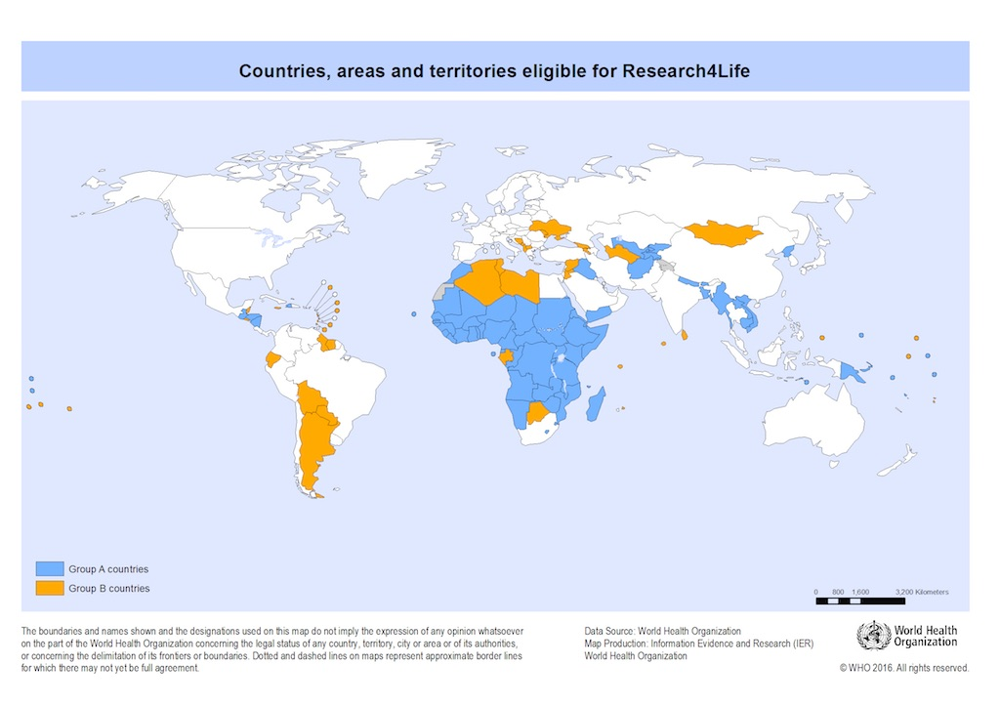
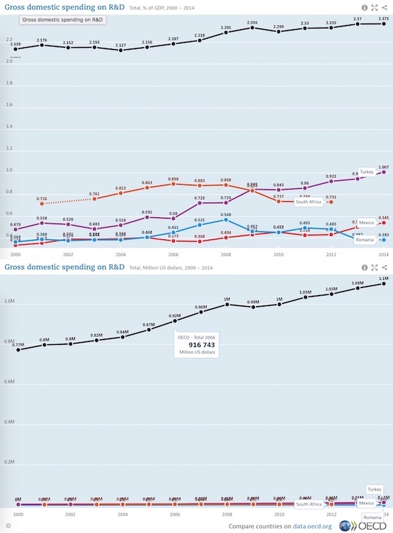

 

I strongly support making research articles freely available, but while open-access publishing means that there is no cost to the reader, there are still costs associated with getting and keeping an article on-line. To cover these costs most journals charge a fee to the authors, the article processing charge (APC). Depending on the journal and the length of article, the APC typically ranges from US$1,500 to US$5,000. But as journals increasingly flip from subscription-based to author-pays models are we seeing yet another barrier to publishing, especially for researchers in developing/low-resource countries?

If you look on the major publishing houses' websites, many waiver the APC for investigators from low and lower-middle-income countries (Figure 1).

 

 
<em>Figure 1. Low and lower middle-income countries falling under the HINARI Access to Research in Health Programme (blue and orange) can request article processing charges to be waived by many of the major publishing groups.</em>

 

This stance on APC by most publishers should be applauded, but where does that leave investigators from upper-middle income countries (e.g., South Africa, China, Brazil) and the poorer high-income countries (e.g., Russia, Croatia, Poland)? Research funding in these countries is well below the OECD average (Figure 2.), and as such research grants in these countries tend to be significantly smaller than those issued in countries in the upper echelons of the high-income category (e.g., USA, Germany, Australia). Indeed, for low-value grants the APC can be a significant proportion of the grant funding available to a researcher.

 

 
<em>Figure 2. Spending on research and development as a percentage of gross domestic product and total amount (US$ millions). Black line: OECD average, Orange: South Africa, Purple: Tukey, Red: Mexico, Blue: Romania.</em>

 

For example, the South African Medical Research Council offers research grants of up to ~US$13,000 direct costs per annum, and researchers may only hold one of these grants at any time. Thus a US$2,000 APC is 15% of the annual value of the grant. If you compare that to a holder of an NIH R01 grant with a modular budget of US$250 000 for direct costs, the APC is 0.8% of the annual grant value.

Thus depending on a researchers means, the affordability of a journal's APC can dictate whether they submit an article to that journal. This scenario moves use away from publishing where it is appropriate, to publishing where you can afford. Is this what we want?

***

_**tl;dr**_

Obviously the issue of APC affordability does not only affect researchers in upper-middle income countries and the poorer high-income countries, and the argument also applies to the _'poor rich'_; investigators from high-income countries that do not have large grants.  
