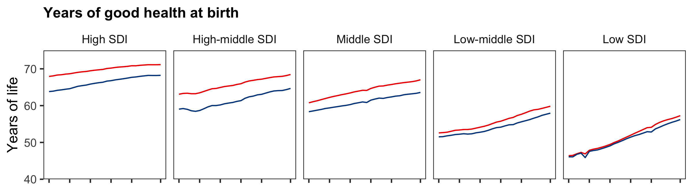

<style>
#img_center60 {
  display: block;
  margin-left: auto;
  margin-right: auto;
  width: 60%
}

#img_center80 {
  display: block;
  margin-left: auto;
  margin-right: auto;
  width: 80%
}
</style>

```{r setup, include = FALSE}
# Load libraries
library(tidyverse)
library(magrittr)
library(gganimate)
library(skimr)

# Set skimr output
skim_with(numeric = list(complete = NULL,
                         p0 = NULL,
                         p50 = median,
                         p100 = NULL))

# Set global knitr chunck options
knitr::opts_chunk$set(warning = FALSE,
                      message = FALSE,
                      fig.align = 'center')
```

<br>

## Background

A recent article in _The Lancet_[^1] reported that the increase in life expectancy that has occurred over the past 28 years (1990 to 2017) is associated with a disproportionate relative increase in time spent in poor health compared to good health. The authors reached this conclusion after analysing data on _total life expectancy_ and _healthy life expectancy (HALE; years of good health)_ from the Global Burden of Diseases, Injuries, and Risk Factors Study 2017 (GBD 2017). The GBD Study, assesses mortality and disability based on 359 causes of death and disability across 195 countries and territories (GBD data are freely available for download from the [Global Burden of Disease Exchange](http://ghdx.healthdata.org/gbd-2017)). 

The figure below is taken directly from the article in _The Lancet_ and shows _years of good health_ and _years of poor health_ (_total life expectancy_ - _years of good health_) for females (<span style="color:#ED0000FF;">red lines</span>) and males (<span style="color:#00468BFF;">blue lines</span>) across socio-demographic index quintiles (High SDI, High-middle SDI, Middle SDI, Middle-low SDI, Low SDI).

<div style="margin-left:auto;margin-right:auto;width:90%;">

</div>

[^1]: GBD 2017 DALYs and HALE Collaborators. Global, regional, and national disability-adjusted life-years (DALYs) for 359 diseases and injuries and healthy life expectancy (HALE) for 195 countries and territories, 1990-2017: a systematic analysis for the Global Burden of Disease Study 2017. _Lancet_ **392**:1859–1922, 2018. doi: [10.1016/S0140-6736(18)32335-3](https://doi.org/10.1016/S0140-6736(18)32335-3).

The figure shows an upward trend in _years of good health_ and _years of poor health_ over the past 28 years, for males and females across the five socio-demographic quintiles. But, it is hard to discern from the plot whether the rate of increase in _years of poor health_ is greater than the rate of increase in _years of good health_, even though this was a key finding of the research. That is, the figure does not accomplish the reason for having a plot, which is to provide a visual aid for interpreting the findings.

So I decided to play with the data myself to see if I could generate more informative plots. 

I approached this task by: 

1. Recapitulating the plot from the article, but with an extra panel showing _total life expectancy_. I decided on this plot because I wanted to confirm that I had downloaded the correct data, and I felt that the _total life expectancy_ panel would help contextualize changes in _years of good health_ and _years of poor health_ data; and by

2. Comparing the cumulative year-over-year percent change in _years of poor health_ and _years of good health_ since 1990. I felt that using the cumulative year-over-year change would allow direct comparison of the long-term trends of two variables measured on the same scale (years), but which have vastly different magnitudes (_years of good health_ contributes 80 to 90% of _total life expectancy_). As an bonus, I decided to animate these plots to get a feel for the new [`gganimate`](https://github.com/thomasp85/gganimate) API.

----

## Download, import, and clean data

First I had to get and clean the data.

I manually downloaded the data from the Global Burden of Disease Exchange website using their [query tool](http://ghdx.healthdata.org/gbd-results-tool) (as far as I know, the site does not have an API to remotely query and retrieve data). I then imported the two _\*.csv_ files I had downloaded (one for _years of good health_, and one for _total life expectancy_), and performed a cursory inspection and a basic clean-up of the data, the code and outputs of which are shown below. 

```{r clean_data}
############################################################
#                                                          #
#                       Import data                        #
#                                                          #
############################################################
# years of good health
hale <- read_csv('_data/2019-01-25-global-burden-of-disease/hale-1990-2017.csv') 
# Life expectancy
life <- read_csv('_data/2019-01-25-global-burden-of-disease/life-expectancy-1990-2017.csv')

############################################################
#                                                          #
#                       Inspect data                       #
#                                                          #
############################################################
skim(hale)
skim(life)

############################################################
#                                                          #
#                        Clean data                        #
#                                                          #
############################################################
data <- life %>% 
    # Join imported datasets
    bind_rows(hale) %>% 
    # Select required columns
    select(measure, location, sex, year, metric, val) %>% 
    # Recode measure category labels
    mutate(measure = str_replace_all(measure,
                                     pattern = 'HALE \\(Healthy life expectancy\\)',
                                     replacement = 'Years of good health')) %>% 
    mutate(measure = str_replace_all(measure,
                                     pattern = 'Life expectancy',
                                     replacement = 'Total life expectancy')) %>% 
    # Order location variable (socio-demographic quintile)
    mutate(location = factor(location,
                             levels = c('High SDI', 'High-middle SDI',
                                        'Middle SDI', 'Low-middle SDI',
                                        'Low SDI'),
                             ordered = TRUE))

# Inspect cleaned data
glimpse(data)
```

The data looked in good order, and only needed some minor cleaning.

----

## Analysis

#### Step 1

**Recapitulate the plot from the article, but with an extra panel showing _total life expectancy_.**

I used the cleaned data to calculate the _years of poor health_[^2], and then generated separate plots for _total life expectancy_,  _years of good health_, and _years of poor health_. For each plot, I presented the data by sex and socio-demographic index quintile. 

Finally, I pieced the individual plots together and formated the visual look using `html/css` (after bumping my head repeatedly against a brick wall trying to get the desired look using the `patchwork` and `cowplot` packages; my usual go to packages for multiplots). 

[^2]: _years of poor health = total life expectancy - years of good health_

```{r step_1, eval = FALSE}
############################################################
#                                                          #
#        Calculate years of poor health since birth        #
#                                                          #
############################################################
delta <- data %>% 
    # Spread the measure column
    spread(key = measure, 
           value = val) %>% 
    # Calculate years unhealthy 
    mutate(`Years of poor health` = `Total life expectancy` - `Years of good health`) %>% 
    # Gather measures again
    gather(key = measure, 
           value = val,
           -location, -sex, -year, -metric)

############################################################
#                                                          #
#                           Plot                           #
#                                                          #
############################################################
# Generate separate plots for each 'measure', and save the outputs.

## Total life expectancy
le <- delta %>% 
    filter(measure == 'Total life expectancy') %>% 
    ggplot(data = .) +
    aes(x = year,
        y = val,
        colour = sex) +
    geom_line() +
    scale_x_continuous(breaks = c(1990, 1995, 2000, 2005, 2010, 2017)) +
    scale_y_continuous(breaks = c(50, 60, 70, 80),
                       limits = c(50, 85),
                       expand = c(0, 0)) +
    scale_colour_manual(values = c('#ED0000', '#00468B')) +
    labs(title = 'Total life expectancy at birth',
         y = 'Years of life') +
    facet_wrap(~ location, 
               ncol = 5) +
    theme_bw(base_size = 12) +
    theme(legend.title = element_blank(),
          legend.position = c(0.99, 0.985),
          legend.justification = c(0.99, 0.985),
          legend.margin = margin(t = 0, r = 0, b = 0, l = 0, unit = 'lines'),
          plot.title = element_text(size = 12, face = 'bold'),
          axis.text.x = element_blank(),
          axis.title.x = element_blank(),
          panel.grid = element_blank(),
          strip.background = element_blank()) 

ggsave(filename = 'le.png',
       plot = le, 
       path = './images/posts/2019-01-25-global-burden-of-disease', 
       width = 8,
       height = 2.2,
       units = 'in')

## Years of good health
healthy <- delta %>% 
    filter(measure == 'Years of good health') %>% 
    ggplot(data = .) +
    aes(x = year,
        y = val,
        colour = sex) +
    geom_line() +
    scale_x_continuous(breaks = c(1990, 1995, 2000, 2005, 2010, 2017)) +
    scale_y_continuous(breaks = c(40, 50, 60, 70),
                       limits = c(40, 75),
                       expand = c(0, 0)) +
    scale_colour_manual(values = c('#ED0000', '#00468B')) +
    labs(title = 'Years of good health at birth',
         y = 'Years of life') +
    facet_wrap(~ location, 
               ncol = 5) +
    theme_bw(base_size = 12) +
    theme(legend.position = 'none',
          axis.text.x = element_blank(),
          axis.title.x = element_blank(),
          plot.title = element_text(size = 12, face = 'bold'),
          panel.grid = element_blank(),
          strip.background = element_blank()) 

ggsave(filename = 'healthy.png',
       plot = healthy, 
       path = './images/posts/2019-01-25-global-burden-of-disease', 
       width = 8,
       height = 2.2,
       units = 'in')

## Poor health
unhealthy <- delta %>% 
    filter(measure == 'Years of poor health') %>% 
    ggplot(data = .) +
    aes(x = year,
        y = val,
        colour = sex) +
    geom_line() +
    scale_x_continuous(breaks = c(1990, 1995, 2000, 2005, 2010, 2017)) +
    scale_y_continuous(breaks = c(6, 8, 10, 12),
                       limits = c(6, 13),
                       expand = c(0, 0)) +
    scale_colour_manual(values = c('#ED0000', '#00468B')) +
    labs(title = 'Years of poor health at birth',
         x = 'Year',
         y = 'Years of life') +
    facet_wrap(~ location, 
               ncol = 5) +
    theme_bw(base_size = 12) +
    theme(legend.position = 'none',
          plot.title = element_text(size = 12, face = 'bold'),
          axis.text.x = element_text(angle = 45,
                                     hjust = 1,
                                     vjust = 1.1),
          panel.grid = element_blank(),
          strip.background = element_blank()) 

ggsave(filename = 'unhealthy.png',
       plot = unhealthy, 
       path = './images/posts/2019-01-25-global-burden-of-disease', 
       width = 8,
       height = 2.75,
       units = 'in')
```

<div>
<div style="margin-left:auto;margin-right:auto;width:90%;">
<div style="border-width:thin;border-style:solid;border-color:#E29EA7;">



</div>
<p style="font-size:90%;font-style:italic;">
<b>Revised figure 1: Trends of total life expectancy at birth, years of good health at birth, and years of poor health at birth by SDI quintile and sex, 1990-2017.</b><br>
SDI=Socio-demographic index
</p>
</div>
</div>

Comparing my figure to the figure from the article, I was satisfied that I had reproduced the original figure (but with a _total life expectancy_ panel). From **Revised figure 1**, it is clear that _total life expectancy_, _years of good health_, and _years of poor health_ increased over time for both sexes, and across all socio-demographic quintiles. Although the trend curves for males and females are roughly parallel for all three measures (with the curves for females shifted upwards relative to those of their male counterparts), there is a progressive reduction in the magnitude of this male/female difference as you move from High SDI countries to Low SDI countries, particularly for _total life expectancy_ and _years of good health_. 

I feel that presenting _total life expectancy_ data in the figure added value. For example, with the addition of _total life expectancy_ data, it is apparent that in Low SDI countries, _total life expectancy_ has consistently been slightly greater in females than in males, yet _years of good health_ in males and females over the same time-period is almost identical. So, the marginally greater _total life expectancy_ in females must reflect more _years of poor health_ compared to males. 

### Step 2

**Compare cumulative year-over-year percent change in _years of poor health_ and _years of good health_ for the past 28 years.**

There were several ways I could have analysed and plotted these data. For example, I could have used: sequential year-over-year percent change data, mean-centered data, or the yearly absolute difference between _years of good health_ and _years of poor health_. But I chose to use cumulative year-over-year percent change because I felt it was the best option for presenting the data. As a relative measure, it corrects for the very large absolute difference between _years of good health_ and _years of poor health_ (~ 38 to 57 years in 1990, depending on SDI quintile and sex), and allows the assessment of the cumulative effect the yearly fluctuations in _years of good health_ and _years of poor health_.

```{r objective_2, eval = FALSE}
############################################################
#                                                          #
#           Plot animated versions of the total            #
#        life expectancy data for males and females        #
#                                                          #
############################################################
# Males
le_male <- delta %>% 
    filter(sex == 'Male') %>% 
    filter(measure == 'Total life expectancy') %>% 
    ggplot(data = .) +
    aes(x = year,
        y = val) +
    geom_line(colour = '#00468B') +
    scale_x_continuous(breaks = c(1990, 1995, 2000, 2005, 2010, 2017)) +
    scale_y_continuous(breaks = c(50, 60, 70, 80),
                       limits = c(50, 85),
                       expand = c(0, 0)) +
    labs(title = 'Total life expectancy at birth',
         y = 'Years of life') +
    facet_wrap(~ location, 
               ncol = 5) +
    theme_bw(base_size = 12) +
    theme(legend.title = element_blank(),
          legend.position = c(0.99, 0.985),
          legend.justification = c(0.99, 0.985),
          legend.margin = margin(t = 0, r = 0, b = 0, l = 0, unit = 'lines'),
          plot.title = element_text(size = 12, face = 'bold'),
          axis.text.x = element_blank(),
          axis.title.x = element_blank(),
          panel.grid = element_blank(),
          strip.background = element_blank()) +
    transition_reveal(year)

le_male <- animate(plot = le_male, 
                   fps = 10,
                   nframes = 150,
                   duration = 15,
                   end_pause = 50,
                   res = 150,
                   width = 8,
                   height = 2.2,
                   units = 'in')

anim_save(filename = 'le_male.gif',
          animation = le_male,
          path = './images/posts/2019-01-25-global-burden-of-disease')

# Females
le_female <- delta %>% 
    filter(sex == 'Female') %>% 
    filter(measure == 'Total life expectancy') %>% 
    ggplot(data = .) +
    aes(x = year,
        y = val) +
    geom_line(colour = '#ED0000') +
    scale_x_continuous(breaks = c(1990, 1995, 2000, 2005, 2010, 2017)) +
    scale_y_continuous(breaks = c(50, 60, 70, 80),
                       limits = c(50, 85),
                       expand = c(0, 0)) +
    labs(title = 'Total life expectancy at birth',
         y = 'Years of life') +
    facet_wrap(~ location, 
               ncol = 5) +
    theme_bw(base_size = 12) +
    theme(legend.title = element_blank(),
          legend.position = c(0.99, 0.985),
          legend.justification = c(0.99, 0.985),
          legend.margin = margin(t = 0, r = 0, b = 0, l = 0, unit = 'lines'),
          plot.title = element_text(size = 12, face = 'bold'),
          axis.text.x = element_blank(),
          axis.title.x = element_blank(),
          panel.grid = element_blank(),
          strip.background = element_blank()) +
    transition_reveal(year)

le_female <- animate(plot = le_female, 
                     fps = 10, 
                     nframes = 150,
                     duration = 15,
                     end_pause = 50,
                     res = 150,
                     width = 8,
                     height = 2.2,
                     units = 'in')

anim_save(filename = 'le_female.gif',
          animation = le_female,
          path = './images/posts/2019-01-25-global-burden-of-disease')

############################################################
#                                                          #
#          General processing that will be useful          #
#             for several plots down the line              #
#                                                          #
############################################################
# Generate a version of the delta dataframe with the measure column spread
delta_spread <- delta %>% 
    # Spread the measures column
    spread(key = measure,
           value = val) 

# Extract 1990 values for each measure and for each subgroup
baseline_1990 <- delta_spread %>%
    group_by(location, sex) %>% 
    # Extract 1990 values 
    filter(year == 1990) %>% 
    # Rename columns
    rename(`Total life expectancy 1990` = `Total life expectancy`,
           `Years of good health 1990` = `Years of good health`,
           `Years of poor unhealth 1990` = `Years of poor health`) %>% 
    # Remove unneeded column
    select(-metric, -year)

# Join baseline_1990 to delta_spread
delta_spread %<>%
    left_join(baseline_1990)

############################################################
#                                                          #
#       Cumulative year-on-year percent change for         #
#    'years of good health' and 'years of poor health'     #
#                                                          #
############################################################
delta_spread %<>% 
    # Year-over-year change for each subgroup
    group_by(location, sex) %>% 
    mutate(p_yoy_good_health = 100 * ((`Years of good health` - 
                                           lag(`Years of good health`)) / lag(`Years of good health`)),
           p_yoy_poor_health = 100 * ((`Years of poor health` - 
                                           lag(`Years of poor health`)) / lag(`Years of poor health`))) %>%
    # Remove lag calc <NA> for 1990, and add cumulative yoy change for each subgroup
    mutate(p_yoy_good_health = ifelse(year == 1990,
                                  yes = 0,
                                  no = p_yoy_good_health),
           p_yoy_poor_health = ifelse(year == 1990,
                                    yes = 0,
                                    no = p_yoy_poor_health)) %>% 
    mutate(p_cum_yoy_good_health = cumsum(p_yoy_good_health), 
           p_cum_yoy_poor_health = cumsum(p_yoy_poor_health)) %>% 
    ungroup()

############################################################
#                                                          #
#           Plot year-on-year percent change for           #
#    'years of good health' and 'years of poor health'     #
#                                                          #
############################################################
# Males
perc_male <- delta_spread %>% 
    filter(sex == 'Male') %>% 
    # Gather cum_yoy_* columns
    gather(key = 'key',
           value = 'value',
           p_cum_yoy_good_health, p_cum_yoy_poor_health) %>% 
    # Plot
    ggplot(data = .) +
    aes(x = year,
        y = value,
        colour = key) +
    geom_line() +
    scale_x_continuous(breaks = c(1990, 1995, 2000, 2005, 2010, 2017)) +
    scale_y_continuous(limits = c(-5, 20),
                       breaks = c(-5, 0, 5, 10, 15, 20)) +
    scale_colour_manual(labels = c('years of\ngood health', 'Years of\npoor health'), 
                        values = c('#56B4E9', '#E69F00')) +
    labs(title = "Cumulative year-over-year percent change in 'years of good health' and 'years of poor health'",
         x = 'Year',
         y = "Cumulative change (%)") +
    facet_wrap(~ location, 
               ncol = 5) +
    theme_bw(base_size = 12) +
    theme(legend.title = element_blank(),
          legend.position = c(0.13, 0.985),
          legend.justification = c(0.99, 0.985),
          legend.margin = margin(t = 0, r = 0, b = 0, l = 0, unit = 'lines'),
          plot.title = element_text(size = 12, face = 'bold'),
          axis.text.x = element_text(angle = 45,
                                     hjust = 1,
                                     vjust = 1.1),
          panel.grid = element_blank(),
          strip.background = element_blank()) +
    transition_reveal(year)

perc_male <- animate(plot = perc_male,
                     fps = 10, 
                     nframes = 150,
                     duration = 15,
                     end_pause = 50,
                     res = 150,
                     width = 8,
                     height = 2.75,
                     units = 'in')

anim_save(filename = 'perc_male.gif',
          animation = perc_male,
          path = './images/posts/2019-01-25-global-burden-of-disease')

# Females
perc_female <- delta_spread %>% 
    filter(sex == 'Female') %>% 
    gather(key = 'key',
           value = 'value',
           p_cum_yoy_good_health, p_cum_yoy_poor_health) %>% 
    # Plot
    ggplot(data = .) +
    aes(x = year,
        y = value,
        colour = key) +
    geom_line() +
    scale_x_continuous(breaks = c(1990, 1995, 2000, 2005, 2010, 2017)) +
    scale_y_continuous(limits = c(-5, 20),
                       breaks = c(-5, 0, 5, 10, 15, 20)) +
    scale_colour_manual(labels = c('Years of\ngood health', 'Years of\npoor health'), 
                        values = c('#56B4E9', '#E69F00')) +
    labs(title = "Cumulative year-over-year percent change in 'years of good health' and 'years of poor health'",
         x = 'Year',
         y = "Cumulative change (%)") +
    facet_wrap(~ location, 
               ncol = 5) +
    theme_bw(base_size = 12) +
    theme(legend.title = element_blank(),
          legend.position = c(0.13, 0.985),
          legend.justification = c(0.99, 0.985),
          legend.margin = margin(t = 0, r = 0, b = 0, l = 0, unit = 'lines'),plot.title = element_text(size = 12, face = 'bold'),
          axis.text.x = element_text(angle = 45,
                                     hjust = 1,
                                     vjust = 1.1),
          panel.grid = element_blank(),
          strip.background = element_blank()) +
    transition_reveal(year)

perc_female <- animate(plot = perc_female, 
                       fps = 10, 
                       nframes = 150,
                       duration = 15,
                       end_pause = 50,
                       res = 150,
                       width = 8,
                       height = 2.75,
                       units = 'in')

anim_save(filename = 'perc_female.gif',
          animation = perc_female,
          path = './images/posts/2019-01-25-global-burden-of-disease')
```

<div style="margin-left:auto;margin-right:auto;max-width:90%;">
<div style="border-width:thin;border-style:solid;border-color:#E29EA7;">
<!-- Females -->
<h3 style="margin-top:0px">Females</h3>


<!-- Males -->
<h3 style="margin-top:0px">Males</h3>


</div>
<p style="font-size:90%;font-style:italic;width:100%;">
<b>Figure 3: Total life expectancy (top panel for each sex), and the cumulative year-over-year percent change in years of good health and years of poor health (bottom panel for each sex) for females (top two panels) and males (bottom two panels), and each SDI quintile.</b><br>
SDI=Socio-demographic index
</p>
</div>

I'm quite pleased with the way the plots of cumulative year-over-year percent change in _years of good health_ and _years of poor health_ came out. I think that compared to the original figure from the publication, it is now much clearer how the relative rate of growth in _years of good health_ and _years of poor health_ has changed over the past three decades. That is, you can now see one of the key finds of the paper, and you can now appreciate the relative changes in the rate of growth in _years of good health_ and _years of poor health_ over time and between SDI quintiles. 

While _total life expectancy_ has followed a relatively smooth upward trajectory between 1990 and 2017 (for both sexes and across SDI quintiles), the relative rate of growth of _years of good health_ and _years of poor health_ to this increase in _total life expectancy_ has see significant shifts over time. And, these shifts are not consistent across SDI quintiles.  

At the two extremes are the High and Low SDI quintiles. The High SDI quintile has seen a dramatic increase in the cumulative year-over-year percent change in _years of poor health_ relative to _years of good health_, with the two curves separating as early as the early 1990s in males and early 2000s in females. The faster rate of growth in _years of poor health_ than _years of good health_ means that _years of poor health_ is contributing proportionately more to the rise in _total life expectancy_ than _years of good health_ is. In the Low SDI quintile, we see the opposite trend, with the _years of poor healthy_ and _years of good health_ curves tracking each other until the mid-1990s in females and mid-2000s for males, after which the cumulative rate of growth in _years of good health_ outstripped that for _years of poor health_. The long-term trends in the Low SDI quintile are desirable, while those in the High SDI quintile are not. 

The remaining quintiles show a graded shift in cumulative year-over-year percent change in _years of good health_ and _years of poor health_ from the situation in the High SDI quintile to the Low SDI quintile.

Hopefully you find the analysis useful. If you have any suggestions on how to improve the blog post, please DM me on Twitter (<a href="https://twitter.com/painblogR" target="_blank">@painblogR</a>), send me an email (<a href="mailto:peter.kamerman@gmail.com">peter.kamerman@gmail.com</a>), or log an issue on the painblogR github repo for this site (<a href="https://github.com/kamermanpr/painblogr-build/issues" target="_blank">kamermanpr/painblogr-build</a>).

----

## Session information

```{r session_info}
sessionInfo()
```

```{r twitter_gif, eval = FALSE, include = FALSE}
# Females
perc_female <- delta_spread %>% 
    filter(sex == 'Female') %>% 
    gather(key = 'key',
           value = 'value',
           p_cum_yoy_good_health, p_cum_yoy_poor_health) %>% 
    # Plot
    ggplot(data = .) +
    aes(x = year,
        y = value,
        colour = key) +
    geom_line() +
    scale_x_continuous(breaks = c(1990, 1995, 2000, 2005, 2010, 2017)) +
    scale_y_continuous(limits = c(-5, 20),
                       breaks = c(-5, 0, 5, 10, 15, 20)) +
    scale_colour_manual(labels = c('Years of good health', 'Years of poor health'), 
                        values = c('#56B4E9', '#E69F00')) +
    labs(title = "Cumulative year-over-year percent change in 'years of good health' and 'years of poor health'",
         subtitle = '(SDI: Socio-demographic index)',
         x = 'Year',
         y = "Cumulative change (%)") +
    facet_wrap(~ location, 
               ncol = 5) +
    theme_bw(base_size = 12) +
    theme(legend.title = element_blank(),
          legend.position = c(0.17, 0.985),
          legend.justification = c(0.99, 0.985),
          legend.margin = margin(t = 0, r = 0, b = 0, l = 0, unit = 'lines'),plot.title = element_text(size = 12, face = 'bold'),
          axis.text.x = element_text(angle = 45,
                                     hjust = 1,
                                     vjust = 1.1),
          plot.subtitle = element_text(size = 10),
          panel.grid = element_blank(),
          strip.background = element_blank()) +
    transition_reveal(year)

perc_female <- animate(plot = perc_female, 
                       end_pause = 50,
                       res = 120,
                       width = 10,
                       height = 3.3,
                       units = 'in')

anim_save(filename = 'twitter_gif.gif',
          animation = perc_female,
          path = './images/posts/2019-01-25-global-burden-of-disease')

```
