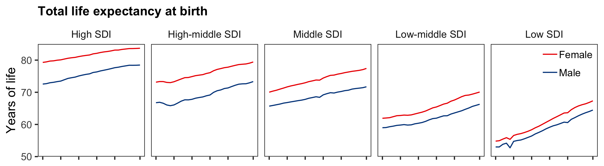
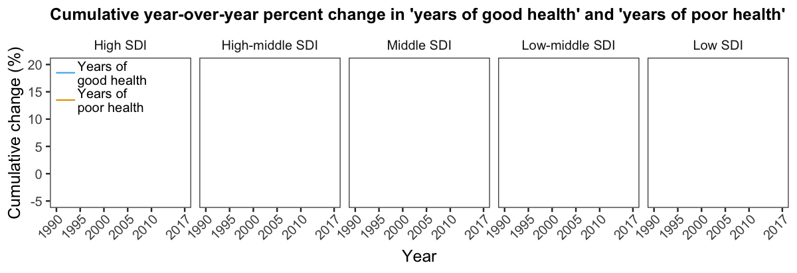

<style>
#img_center60 {
  display: block;
  margin-left: auto;
  margin-right: auto;
  width: 60%
}

#img_center80 {
  display: block;
  margin-left: auto;
  margin-right: auto;
  width: 80%
}
</style>

```{r setup, include = FALSE}
# Load libraries
library(tidyverse)
library(magrittr)
library(gganimate)
library(skimr)

# Set skimr output
skim_with(numeric = list(complete = NULL,
                         p0 = NULL,
                         p50 = median,
                         p100 = NULL))

# Set global knitr chunck options
knitr::opts_chunk$set(warning = FALSE,
                      message = FALSE,
                      fig.align = 'center')
```

<br>

## Background

A recent article in _The Lancet_[^1] reported that in most cases, increases in life expectancy that have occured over the past 28 years (1990 to 2017) are associated with a disproportionate increase in years spend in poor health compared to years of good health. They made this assessment using data from the Global Burden of Diseases, Injuries, and Risk Factors Study 2017 (GBD 2017). The GBD 2017 data, which are freely available for download from the [Global Burden of Disease Exchange](http://ghdx.healthdata.org/gbd-2017), includes estimates of years of lost life and years lived with disability based on 359 causes of death and disability across 195 countries and territories. Two key indices that are calculated are _total life expectancy_ and _healthy life expectancy (HALE; years of good health)_. 

The figure below is taken directly from the article in _The Lancet_ and shows _HALE_ and _years of poor health_ ( _total life expectancy_ - _HALE_ ) for females (<span style="color:#ED0000FF;">red lines</span>) and males (<span style="color:#00468BFF;">blue lines</span>) across socio-demographic index quintiles (High, High-middle, Middle, Middle-low, and Low SDI).

<div style="margin-left:auto;margin-right:auto;width:80%;">

</div>

[^1]: GBD 2017 DALYs and HALE Collaborators. Global, regional, and national disability-adjusted life-years (DALYs) for 359 diseases and injuries and healthy life expectancy (HALE) for 195 countries and territories, 1990-2017: a systematic analysis for the Global Burden of Disease Study 2017. _Lancet_ **392**:1859–1922, 2018. doi: [10.1016/S0140-6736(18)32335-3](https://doi.org/10.1016/S0140-6736(18)32335-3).

The figure shows an upward trend in _HALE_ and _years of poor health_ over the past 28 years, for males and females across the five socio-demographic quintiles. But, it is hard to see from the plot whether the rate of increase in _years of poor health_ is greater than that for _HALE_; a key finding in the paper. That is, the plot does not aid the interpretation of the findings by a reader.

So I decided to play with the data myself to to see if I could generate a more informative graphical depiction of the findings. 

To achieve this aim, I decided to: 

1. recapitulate the plot from the article, but with an extra panel showing _total life expectancy_. This plot would confirm whether I had downloaded the correct data, and the extra panel would help contextualize changes in _HALE_ and _years of poor health_ data with _total life expectancy_; and

2. to compare the rate of increase in _years of poor health_ and _HALE_ since 1990 using animated plots, thus providing a clearer picture of the relative contribution of the two measures to inceases in _total life expectancy_ over the past 28 years. 

----

## Download, import, and clean data

First I had to get and clean the data.

I manually downloaded the data from the Global Burden of Disease Exchange website using their [query tool](http://ghdx.healthdata.org/gbd-results-tool) (as far as I know, the site does not have an API to remotely query and retrieve data). I then imported the two _\*.csv_ files I had downloaded (one for _HALE_, and one for _total life expectancy_), and performed a cursory inspection and a basic clean-up of the data, the code and outputs of which are shown below. 

```{r clean_data}
############################################################
#                                                          #
#                       Import data                        #
#                                                          #
############################################################
# HALE
hale <- read_csv('_data/2019-01-25-global-burden-of-disease/hale-1990-2017.csv') 
# Life expectancy
life <- read_csv('_data/2019-01-25-global-burden-of-disease/life-expectancy-1990-2017.csv')

############################################################
#                                                          #
#                       Inspect data                       #
#                                                          #
############################################################
skim(hale)
skim(life)

############################################################
#                                                          #
#                        Clean data                        #
#                                                          #
############################################################
data <- life %>% 
    # Join imported datasets
    bind_rows(hale) %>% 
    # Select required columns
    select(measure, location, sex, year, metric, val) %>% 
    # Recode HALE category labels
    mutate(measure = str_replace_all(measure,
                                     pattern = 'HALE \\(Healthy life expectancy\\)',
                                     replacement = 'Years healthy')) %>% 
    # Order location variable (socio-demographic quintile)
    mutate(location = factor(location,
                             levels = c('High SDI', 'High-middle SDI',
                                        'Middle SDI', 'Low-middle SDI',
                                        'Low SDI'),
                             ordered = TRUE))

# Inspect cleaned data
glimpse(data)
```

The data looked in good order so I proceeded with my two aims.

----

## Analysis

### Aim 1
**Recapitulate the plot from the article, but with an extra panel showing _total life expectancy_.**

I used the cleaned data to calculate the _years of poor health_[^2], and then generated separate plots for _total life expectancy_,  _HALE_, and _years of poor health_ by sex and socio-demographic index quintile. 

Finally, I pieced the individuals plots together and formated the visual look using html/css (after bumping my head repeatedly against a brick wall trying to get the desired look using the `patchwork` and `cowplot` packages; my usual go to packages for multiplots). 

[^2]: _years of poor health = total life expectancy - HALE_

```{r objective_1, eval = FALSE}
############################################################
#                                                          #
#        Calculate years of poor health since birth        #
#                                                          #
############################################################
delta <- data %>% 
    # Spread the measure column
    spread(key = measure, 
           value = val) %>% 
    # Calculate years unhealthy 
    mutate(`Years unhealthy` = `Life expectancy` - `Years healthy`) %>% 
    # Gather measures again
    gather(key = measure, 
           value = val,
           -location, -sex, -year, -metric)

############################################################
#                                                          #
#                           Plot                           #
#                                                          #
############################################################
# Generate separate plots for each 'measure', and save the outputs.

## Total life expectancy
le <- delta %>% 
    filter(measure == 'Life expectancy') %>% 
    ggplot(data = .) +
    aes(x = year,
        y = val,
        colour = sex) +
    geom_line() +
    scale_x_continuous(breaks = c(1990, 1995, 2000, 2005, 2010, 2017)) +
    scale_y_continuous(breaks = c(50, 60, 70, 80),
                       limits = c(50, 85),
                       expand = c(0, 0)) +
    scale_colour_manual(values = c('#ED0000', '#00468B')) +
    labs(title = 'Life expectancy at birth',
         y = 'Years of life') +
    facet_wrap(~ location, 
               ncol = 5) +
    theme_bw(base_size = 12) +
    theme(legend.title = element_blank(),
          legend.position = c(0.99, 0.985),
          legend.justification = c(0.99, 0.985),
          legend.margin = margin(t = 0, r = 0, b = 0, l = 0, unit = 'lines'),
          plot.title = element_text(size = 12, face = 'bold'),
          axis.text.x = element_blank(),
          axis.title.x = element_blank(),
          panel.grid = element_blank(),
          strip.background = element_blank()) 

ggsave(filename = 'le.png',
       plot = le, 
       path = './images/posts/2019-01-25-global-burden-of-disease', 
       width = 8,
       height = 2.2,
       units = 'in')

## HALE
healthy <- delta %>% 
    filter(measure == 'Years healthy') %>% 
    ggplot(data = .) +
    aes(x = year,
        y = val,
        colour = sex) +
    geom_line() +
    scale_x_continuous(breaks = c(1990, 1995, 2000, 2005, 2010, 2017)) +
    scale_y_continuous(breaks = c(40, 50, 60, 70),
                       limits = c(40, 75),
                       expand = c(0, 0)) +
    scale_colour_manual(values = c('#ED0000', '#00468B')) +
    labs(title = 'HALE at birth',
         y = 'Years of life') +
    facet_wrap(~ location, 
               ncol = 5) +
    theme_bw(base_size = 12) +
    theme(legend.position = 'none',
          axis.text.x = element_blank(),
          axis.title.x = element_blank(),
          plot.title = element_text(size = 12, face = 'bold'),
          panel.grid = element_blank(),
          strip.background = element_blank()) 

ggsave(filename = 'healthy.png',
       plot = healthy, 
       path = './images/posts/2019-01-25-global-burden-of-disease', 
       width = 8,
       height = 2.2,
       units = 'in')

## Poor health
unhealthy <- delta %>% 
    filter(measure == 'Years unhealthy') %>% 
    ggplot(data = .) +
    aes(x = year,
        y = val,
        colour = sex) +
    geom_line() +
    scale_x_continuous(breaks = c(1990, 1995, 2000, 2005, 2010, 2017)) +
    scale_y_continuous(breaks = c(6, 8, 10, 12),
                       limits = c(6, 13),
                       expand = c(0, 0)) +
    scale_colour_manual(values = c('#ED0000', '#00468B')) +
    labs(title = 'Years of poor health from birth',
         x = 'Year',
         y = 'Years of life') +
    facet_wrap(~ location, 
               ncol = 5) +
    theme_bw(base_size = 12) +
    theme(legend.position = 'none',
          plot.title = element_text(size = 12, face = 'bold'),
          axis.text.x = element_text(angle = 45,
                                     hjust = 1,
                                     vjust = 1.1),
          panel.grid = element_blank(),
          strip.background = element_blank()) 

ggsave(filename = 'unhealthy.png',
       plot = unhealthy, 
       path = './images/posts/2019-01-25-global-burden-of-disease', 
       width = 8,
       height = 2.75,
       units = 'in')
```

<div>
<div style="margin-left:auto;margin-right:auto;width:80%;">
<div style="border-width:thin;border-style:solid;border-color:#E29EA7;">



</div>
<p style="font-size:90%;font-style:italic;">
<b>Revised figure 1: Trends of life expectancy at birth, HALE at birth, and years of poor health from birth by SDI quintile and sex, 1990-2017</b><br>
HALE=Healthy life expectancy, SDI=Socio-demographic index
</p>
</div>
</div>

Comparing this updated figure with that from the article, I was satisfied that I had reproduced the original figure (but with a _total life expectancy_ panel). From **Revised figure 1**, it is clear that _total life expectancy_, _HALE_, and _years of poor health_ increased over time for both sexes, and across all socio-demographic quintiles. Although the trend curves for males and females are roughly parallel for all three measures (with the curves for females shifted upwards relative to those of their male counterparts), there is a progressive reduction in the magnitude of this male/female difference as you move from High SDI countries to Low SDI countries, particularly for _total life expectancy_ and _HALE_. 

I feel that presenting _total life expectancy_ data in the figure added value. For example, in Low SDI countries, _total life expectancy_ has consistently been only slightly greater in females than in males, yet _HALE_ in males and females over the same time-period is almost identical, and so the slightly greater _total life expectancy_ in females must primarily reflect more _years of poor health_ in females compared to males. 

### Aim 2
**Compare the rate of increase in _years of poor health_ and _HALE_ over time using animated plots.**

To my mind, the best way to present the data in a way that: 

1) corrected for the very large difference between _HALE_ and _years of poor health_ in 1990 (~ 38 to 57 years depending on SDI quintile and sex), and

2) accentuated changes in _HALE_ and _years of poor health_ relative to each other over time,

was by calculating the cumulative year-over-year percentage change in _HALE_ and _years of poor health_ between 1990 and 2017. Another option would be to plot mean-centered _HALE_ and _years of poor health_ values over time. 

```{r objective_2, eval = FALSE}
############################################################
#                                                          #
#           Plot animated versions of the total            #
#        life expectancy data for males and females        #
#                                                          #
############################################################
# Males
le_male <- delta %>% 
    filter(sex == 'Male') %>% 
    filter(measure == 'Life expectancy') %>% 
    ggplot(data = .) +
    aes(x = year,
        y = val) +
    geom_line(colour = '#00468B') +
    scale_x_continuous(breaks = c(1990, 1995, 2000, 2005, 2010, 2017)) +
    scale_y_continuous(breaks = c(50, 60, 70, 80),
                       limits = c(50, 85),
                       expand = c(0, 0)) +
    labs(title = 'Life expectancy at birth',
         y = 'Years of life') +
    facet_wrap(~ location, 
               ncol = 5) +
    theme_bw(base_size = 12) +
    theme(legend.title = element_blank(),
          legend.position = c(0.99, 0.985),
          legend.justification = c(0.99, 0.985),
          legend.margin = margin(t = 0, r = 0, b = 0, l = 0, unit = 'lines'),
          plot.title = element_text(size = 12, face = 'bold'),
          axis.text.x = element_blank(),
          axis.title.x = element_blank(),
          panel.grid = element_blank(),
          strip.background = element_blank()) +
    transition_reveal(year)

le_male <- animate(plot = le_male, 
                   fps = 10,
                   nframes = 150,
                   duration = 15,
                   end_pause = 50,
                   res = 150,
                   width = 8,
                   height = 2.2,
                   units = 'in')

anim_save(filename = 'le_male.gif',
          animation = le_male,
          path = './images/posts/2019-01-25-global-burden-of-disease')

# Females
le_female <- delta %>% 
    filter(sex == 'Female') %>% 
    filter(measure == 'Life expectancy') %>% 
    ggplot(data = .) +
    aes(x = year,
        y = val) +
    geom_line(colour = '#ED0000') +
    scale_x_continuous(breaks = c(1990, 1995, 2000, 2005, 2010, 2017)) +
    scale_y_continuous(breaks = c(50, 60, 70, 80),
                       limits = c(50, 85),
                       expand = c(0, 0)) +
    labs(title = 'Life expectancy at birth',
         y = 'Years of life') +
    facet_wrap(~ location, 
               ncol = 5) +
    theme_bw(base_size = 12) +
    theme(legend.title = element_blank(),
          legend.position = c(0.99, 0.985),
          legend.justification = c(0.99, 0.985),
          legend.margin = margin(t = 0, r = 0, b = 0, l = 0, unit = 'lines'),
          plot.title = element_text(size = 12, face = 'bold'),
          axis.text.x = element_blank(),
          axis.title.x = element_blank(),
          panel.grid = element_blank(),
          strip.background = element_blank()) +
    transition_reveal(year)

le_female <- animate(plot = le_female, 
                     fps = 10, 
                     nframes = 150,
                     duration = 15,
                     end_pause = 50,
                     res = 150,
                     width = 8,
                     height = 2.2,
                     units = 'in')

anim_save(filename = 'le_female.gif',
          animation = le_female,
          path = './images/posts/2019-01-25-global-burden-of-disease')

############################################################
#                                                          #
#          General processing that will be useful          #
#             for several plots down the line              #
#                                                          #
############################################################
# Generate a version of the delta dataframe with the measure column spread
delta_spread <- delta %>% 
    # Spread the measures column
    spread(key = measure,
           value = val) 

# Extract 1990 values for each measure and for each subgroup
baseline_1990 <- delta_spread %>%
    group_by(location, sex) %>% 
    # Extract 1990 values 
    filter(year == 1990) %>% 
    # Rename columns
    rename(`Life expectancy 1990` = `Life expectancy`,
           `Years healthy 1990` = `Years healthy`,
           `Years unhealthy 1990` = `Years unhealthy`) %>% 
    # Remove unneeded column
    select(-metric, -year)

# Join baseline_1990 to delta_spread
delta_spread %<>%
    left_join(baseline_1990)

############################################################
#                                                          #
#       Cumulative year-on-year percent change for         #
#             HALE and 'years of poor health'              #
#                                                          #
############################################################
delta_spread %<>% 
    # Year-over-year change for each subgroup
    group_by(location, sex) %>% 
    mutate(p_yoy_healthy = 100 * ((`Years healthy` - lag(`Years healthy`)) / lag(`Years healthy`)),
           p_yoy_unhealthy = 100 * ((`Years unhealthy` - lag(`Years unhealthy`)) / lag(`Years unhealthy`))) %>% 
    # Remove lag calc <NA> for 1990, and add cumulative yoy change for each subgroup
    mutate(p_yoy_healthy = ifelse(year == 1990,
                                  yes = 0,
                                  no = p_yoy_healthy),
           p_yoy_unhealthy = ifelse(year == 1990,
                                    yes = 0,
                                    no = p_yoy_unhealthy)) %>% 
    mutate(p_cumm_yoy_healthy = cumsum(p_yoy_healthy), 
           p_cumm_yoy_unhealthy = cumsum(p_yoy_unhealthy)) %>% 
    ungroup()

############################################################
#                                                          #
#           Plot year-on-year percent change for           #
#             HALE and 'years of poor health'              #
#                                                          #
############################################################
# Males
perc_male <- delta_spread %>% 
    filter(sex == 'Male') %>% 
    # Gather cumm_yoy_* columns
    gather(key = 'key',
           value = 'value',
           p_cumm_yoy_healthy, p_cumm_yoy_unhealthy) %>% 
    # Plot
    ggplot(data = .) +
    aes(x = year,
        y = value,
        colour = key) +
    geom_line() +
    scale_x_continuous(breaks = c(1990, 1995, 2000, 2005, 2010, 2017)) +
    scale_y_continuous(limits = c(-5, 20),
                       breaks = c(-5, 0, 5, 10, 15, 20)) +
    scale_colour_manual(labels = c('HALE', 'Years of\npoor health'), 
                        values = c('#56B4E9', '#E69F00')) +
    labs(title = "Cumulative year-over-year percent change in HALE and 'years of poor health'",
         x = 'Year',
         y = "Cumulative change (%)") +
    facet_wrap(~ location, 
               ncol = 5) +
    theme_bw(base_size = 12) +
    theme(legend.title = element_blank(),
          legend.position = c(0.13, 0.985),
          legend.justification = c(0.99, 0.985),
          legend.margin = margin(t = 0, r = 0, b = 0, l = 0, unit = 'lines'),
          plot.title = element_text(size = 12, face = 'bold'),
          axis.text.x = element_text(angle = 45,
                                     hjust = 1,
                                     vjust = 1.1),
          panel.grid = element_blank(),
          strip.background = element_blank()) +
    transition_reveal(year)

perc_male <- animate(plot = perc_male,
                     fps = 10, 
                     nframes = 150,
                     duration = 15,
                     end_pause = 50,
                     res = 150,
                     width = 8,
                     height = 2.75,
                     units = 'in')

anim_save(filename = 'perc_male.gif',
          animation = perc_male,
          path = './images/posts/2019-01-25-global-burden-of-disease')

# Females
perc_female <- delta_spread %>% 
    filter(sex == 'Female') %>% 
    gather(key = 'key',
           value = 'value',
           p_cumm_yoy_healthy, p_cumm_yoy_unhealthy) %>% 
    # Plot
    ggplot(data = .) +
    aes(x = year,
        y = value,
        colour = key) +
    geom_line() +
    scale_x_continuous(breaks = c(1990, 1995, 2000, 2005, 2010, 2017)) +
    scale_y_continuous(limits = c(-5, 20),
                       breaks = c(-5, 0, 5, 10, 15, 20)) +
    scale_colour_manual(labels = c('HALE', 'Years of\npoor health'), 
                        values = c('#56B4E9', '#E69F00')) +
    labs(title = "Cumulative year-over-year percent change in HALE and 'years of poor health'",
         x = 'Year',
         y = "Cumulative change (%)") +
    facet_wrap(~ location, 
               ncol = 5) +
    theme_bw(base_size = 12) +
    theme(legend.title = element_blank(),
          legend.position = c(0.13, 0.985),
          legend.justification = c(0.99, 0.985),
          legend.margin = margin(t = 0, r = 0, b = 0, l = 0, unit = 'lines'),plot.title = element_text(size = 12, face = 'bold'),
          axis.text.x = element_text(angle = 45,
                                     hjust = 1,
                                     vjust = 1.1),
          panel.grid = element_blank(),
          strip.background = element_blank()) +
    transition_reveal(year)

perc_female <- animate(plot = perc_female, 
                       fps = 10, 
                       nframes = 150,
                       duration = 15,
                       end_pause = 50,
                       res = 150,
                       width = 8,
                       height = 2.75,
                       units = 'in')

anim_save(filename = 'perc_female.gif',
          animation = perc_female,
          path = './images/posts/2019-01-25-global-burden-of-disease')
```

<div style="margin-left:auto;margin-right:auto;max-width:80%;">
<div style="border-width:thin;border-style:solid;border-color:#E29EA7;">
<!-- Females -->
<h3 style="margin-top:0px">Females</h3>


<!-- Males -->
<h3 style="margin-top:0px">Males</h3>


</div>
<p style="font-size:80%;font-style:italic;width:100%;">
<b>Figure 3: Total life expectancy (top panel for each sex), and the Cumulative year-over-year percent change in HALE and 'years of poor health' (bottom panel for each sex) for females (top two panels) and males (bottom two panels), and each SDI quintile</b><br>
HALE=Healthy life expectancy, SDI=Socio-demographic index
</p>
</div>

### Summary

I'm quite please with the way the relative rates of increase in _HALE_ and _years of poor health_ have changed over the past 28 years, while _total life expectancy_ has followed a relatively smooth upward trajectory over the same period. Differences in the _HALE_ and _years of poor health_ curves over time and across SDI quintiles, together with the similarity in the curves across the sexes, are clearly discernable; something that cannot be said about the figure from the original article. 

At the two extremes are the High and Low SDI quintiles. High SDI quintile has seen a dramatic increase in the cumulative year-over-year percent change in _years of poor healthy_ relative to _HALE_, with the two curves separating as early as the early 1990s in males and early 2000s in females. In the Low SDI quintile, the two curves tracked each other until the mid-1990s in females and mid-2000s for males, after which the cumulative year-over-year percent change in _HALE_ outstripped that for _years of poor healthy_. The longterm trends in the Low SDI quintile are desirable, while those in the High SDI quntile are not. 

The remaining quintiles show a graded shift in cumulative year-over-year percent change in _HALE_ and _years of poor health_ from the situation in the High SDI quintile to the Low SDI quintile.

Hopefully you find the analysis useful. If you have any suggestions on how to improve the blog post, please add a comment below.

----

## Session information

```{r session_info}
sessionInfo()
```

```{r twitter_gif, eval = FALSE, include = FALSE}
# Females
perc_female <- delta_spread %>% 
    filter(sex == 'Female') %>% 
    gather(key = 'key',
           value = 'value',
           p_cumm_yoy_healthy, p_cumm_yoy_unhealthy) %>% 
    # Plot
    ggplot(data = .) +
    aes(x = year,
        y = value,
        colour = key) +
    geom_line() +
    scale_x_continuous(breaks = c(1990, 1995, 2000, 2005, 2010, 2017)) +
    scale_y_continuous(limits = c(-5, 20),
                       breaks = c(-5, 0, 5, 10, 15, 20)) +
    scale_colour_manual(labels = c('Years of good health', 'Years of poor health'), 
                        values = c('#56B4E9', '#E69F00')) +
    labs(title = "Cumulative year-over-year percent change in 'years of good health' and 'years of poor health'",
         x = 'Year',
         y = "Cumulative YOY % change") +
    facet_wrap(~ location, 
               ncol = 5) +
    theme_bw(base_size = 12) +
    theme(legend.title = element_blank(),
          legend.position = c(0.15, 0.985),
          legend.justification = c(0.99, 0.985),
          legend.margin = margin(t = 0, r = 0, b = 0, l = 0, unit = 'lines'),plot.title = element_text(size = 12, face = 'bold'),
          axis.text.x = element_text(angle = 45,
                                     hjust = 1,
                                     vjust = 1.1),
          panel.grid = element_blank(),
          strip.background = element_blank()) +
    transition_reveal(year)

perc_female <- animate(plot = perc_female, 
                       end_pause = 50,
                       res = 150,
                       width = 12,
                       height = 3.8,
                       units = 'in')

ggsave(filename = 'twitter_gif.png',
       plot = perc_female,
       path = './images/posts/2019-01-25-global-burden-of-disease',
       width = 12,
       height = 3.8,
       units = 'in')

anim_save(filename = 'twitter_gif.gif',
          animation = perc_female,
          path = './images/posts/2019-01-25-global-burden-of-disease')

```
