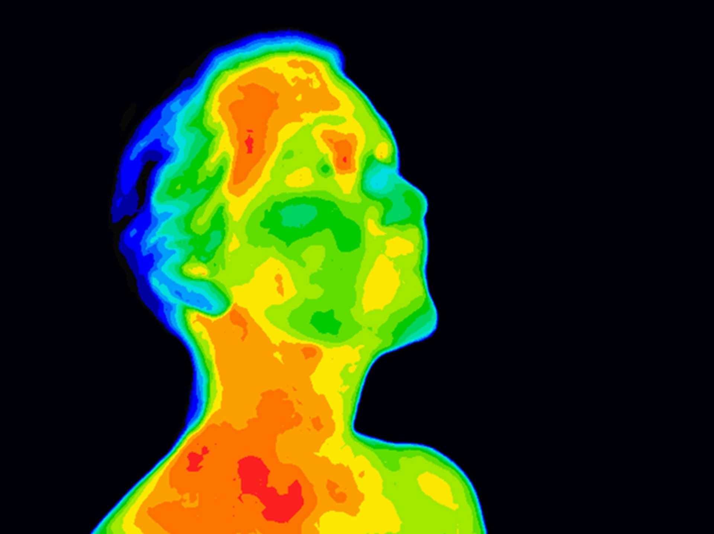

As lockdowns are lifted, procedures are being put in place to reduce the spread of [COVID-19](https://theconversation.com/africa/covid-19){target="_blank"}. Along with physical distancing, hand sanitisation and [wearing of masks](https://theconversation.com/african-countries-are-moving-to-make-masks-mandatory-key-questions-answered-137516){target="_blank"}, [fever screening](https://www.nytimes.com/2020/05/11/technology/coronavirus-worker-testing-privacy.html){target="_blank"} is increasingly being set up as a requirement before entry is allowed into hospitals, shops, workplaces and schools. But there are physiological and clinical reasons why fever screening simply won’t work.

Andrea Fuller and Duncan Mitchell explain why fever screening is unlikely to reduce the spread of the virus. Their arguments are based on an understanding of the physiology of fever, body temperature measurement, and fever prevalence in people who transmit COVID-19.

## What happens to your body when you have a fever?
Fever is a temporary elevation of body core temperature. It is part of a [defensive response](https://www.sciencedirect.com/science/article/abs/pii/S0889159115004079?casa_token=7_0RxEml1XkAAAAA:BLgBVOlXpp6vZuDa5dwuIpbpsdNhIS0YbRX8Q7nI_0-MMw1GZzVz_WYtNCRq4Ue1qAEzwTIx7Mw){target="_blank"} to infection by a virus.

When you develop a fever, you feel cold, heat generation in your body increases (achieved by shivering) and heat loss decreases (achieved by seeking warmth, covering up and reducing the flow of warm blood to the skin). When a fever breaks, either naturally or because you have taken an antipyretic like paracetamol, you feel warm. Your reactions include increasing the flow of warm blood to the skin and sweating, which helps to bring the body’s core temperature back to normal.

In addition to fever, infection usually comes with what scientists call “sickness behaviour”. The same immune responses that cause body temperature to rise make you sleepy, lose your appetite, give you a feeling of discomfort and a desire to avoid social interactions. If you do get a fever and sickness behaviour from COVID-19, you will not want to shop, go to work or visit friends, and you should not do so. Parents usually know when their children are infected even without the help of a thermometer. A child that curls up under the blankets, looks miserable, and complains abnormally, should not be sent to school.

## What are the limitations to infrared thermometers or thermal cameras detecting fevers?
Detecting fever requires measuring body core temperature. To do that accurately, you need to put a thermometer into the body core. Temperature in the rectum and the mouth get close to body core temperature.

Needing to measure body core temperature raises the first problem with fever screening. Thermal cameras and infrared thermometers measure heat radiating from a surface – in other words surface temperature. They don’t measure body core temperature.

Measuring surface temperature has contributed usefully to [healthcare and to biology](https://onlinelibrary.wiley.com/doi/abs/10.1111/j.1365-2907.2007.00111.x){target="_blank"}. For example, infrared cameras have shown whether [skin grafts are receiving blood](https://www.plasticsurgery.theclinics.com/article/S0094-1298(11)00022-8/abstract){target="_blank"}. On the biology front they have shown that toucans dump body heat [through their bills](https://science.sciencemag.org/content/325/5939/468?casa_token=8sYjYaq1yM8AAAAA:qxvgTZ4nHtC8xT3kpf8OxWTmeGxRQqsPy2O6WGpdj0QyYm2g-rVUVkPQ0E2Hao025n_5C7mE_HEhf-Y){target="_blank"}.

But the forehead skin or inner eye temperatures that infrared thermometers or thermal cameras usually measure in fever screening are not body core temperatures.

Human surface temperature is heavily [influenced by environmental conditions](http://www.uhlen.at/thermology-international/archive/Fever%20screening%20and%20infrared%20...pdf){target="_blank"}. In cool environments, surface temperatures can be much lower than body core temperature. And doing [exercise](https://www.tandfonline.com/doi/full/10.1080/03091900600711381){target="_blank"}, or being exposed to the sun, can raise the temperature on our foreheads above body core temperature. Thermal cameras screen for high skin temperature. They can and do find high face temperatures that have nothing to do with infections. Those “[false positives](https://www.eurosurveillance.org/content/10.2807/1560-7917.ES.2020.25.5.2000080;jsessionid=tf38nvbo2h6-at8kDrFqpbG6.i-0b3d9850f4681504f-ecdclive){target="_blank"}” waste time and money in unnecessary follow-up.

Another problem is that skin temperature does not rise during the developing phase of a fever. It falls, because warm blood is kept away from the skin. So your skin temperature changes in the opposite direction to your body core temperature.

Thermal cameras would declare you safe, because your skin temperature is low, but you could be in the most infectious phase of the fever. No surface temperature is a reliable indicator of fever.

## Could better fever screening detect COVID-19?
Even if infrared thermometers could detect fever reliably, they could not detect COVID-19 reliably. Nor could any other thermometer. Patients with COVID-19 are not guaranteed to have a fever.

Recent [research](https://www.theguardian.com/world/2020/may/30/could-nearly-half-of-those-with-covid-19-have-no-idea-they-are-infected){target="_blank"} indicates that many people who test positive for COVID-19, and especially children, never have any detectable sign of illness, including fever.

Even people who later do show symptoms will not have a fever during COVID-19’s [incubation phase](https://www.acpjournals.org/doi/full/10.7326/M20-0504){target="_blank"}, which can last nearly two weeks. During this period, when they are asymptomatic, they can [spread the virus](https://wellcomeopenresearch.org/articles/5-58){target="_blank"}. The finding that infected people without symptoms shed virus is the [Achilles’ heel of controlling the current pandemic](https://www.nejm.org/doi/10.1056/NEJMe2009758){target="_blank"}.

To add to the problem, not all patients with symptoms will have a fever, at least on the basis of once-off measurement. Only [31% of patients](https://jamanetwork.com/journals/jama/fullarticle/2765184){target="_blank"} presenting at New York State hospitals with COVID-19 had fevers.

So, in addition to not measuring body core temperature well, infrared thermometers are being used to find a high temperature that many people exposed to COVID-19 won’t have.

## Has fever screening ever helped to prevent the spread of viruses?
Thermal cameras were introduced at airports at the outbreak of the 2002/3 [Severe Acute Respiratory Syndrome](https://www.who.int/ith/diseases/sars/en/){target="_blank"} (SARS) pandemic. They were widespread in airports during the 2009 Influenza A (H1N1) pandemic. But for medical and technological reasons they have [failed to prevent](https://www.mdpi.com/1660-4601/16/23/4638){target="_blank"} the import of any virus causing respiratory disease. They have failed even in combination with other interventions like follow-up contact and health declaration questionnaires. For example, 930 people who presented as potentially infected candidates were picked out by thermal screening from over 9 million passengers entering Japan in 2009/2010. But [not one case of H1N1 influenza was diagnosed](https://bmcinfectdis.biomedcentral.com/articles/10.1186/1471-2334-11-111){target="_blank"}.

The data from Ebola shows the same pattern. Not one case of Ebola virus infection was picked up in 166,242 airport passengers screened when entering and leaving Sierra Leone in the 2014/2016 [outbreak](https://www.ncbi.nlm.nih.gov/pmc/articles/PMC6930773/){target="_blank"}.

In the case of COVID-19, CNN has reported that [no cases were detected](https://edition.cnn.com/2020/02/19/health/coronavirus-airport-temperature-checks/index.html){target="_blank"} among the more than 30,000 passengers screened with thermal cameras at US airports by mid-February 2020.

Some scientists have been forthright about the dubious value of fever screening, arguing that border screening for infectious diseases [should not be continued](https://www.ncbi.nlm.nih.gov/pmc/articles/PMC4313627/){target="_blank"}.

## Is there any place for fever screening?
Perhaps, there may be benefits.

Some people with viral infections who know they are sick attempt to conceal their illness. Travellers wanting to fly home are [prone to do so](https://www.sciencedirect.com/science/article/pii/S1477893904001267?via%3Dihub){target="_blank"}. Others take antipyretic drugs, hoping to avoid triggering thermal cameras.

Though there still is no scientific evidence, [researchers have suggested](https://www.sciencemag.org/news/2020/03/why-airport-screening-wont-stop-spread-coronavirus){target="_blank"} that the prospect of being caught by fever screening is a deterrent to such dishonesty.

But we do not believe that the potential benefit outweighs the negatives. Apart from fever screening being unreliable, infrared thermometry poses a risk to thermometer operators who are required to come up close to potentially infected persons. Successfully passing a fever screen can create a false sense of security. And the thermal cameras used for mass screening are costly. So are the personnel required for any fever screening.

****

#### Author affiliations

- **Andrea Fuller**: Professor of Physiology and Director of the Brain Function Research Group, University of the Witwatersrand, South Africa. Email: [andrea.fuller@wits.ac.za](mailto:andrea.fuller@wits.ac.za); Website: [wildlifeconservationphysiology.com](https://www.wildlifeconservationphysiology.com/){target="_blank"}

- **Duncan Mitchell**: Adjunct Professor in the School of Human Sciences, University of Western Australia, Australia; Honorary Professorial Research Fellow, University of the Witwatersrand, South Africa. Email: [duncanmitch@gmail.com](mailto:duncanmitch@gmail.com)

****

An edit version of this article was published on [**The Conversation, Africa**](https://theconversation.com/so-you-think-investing-in-fever-screening-can-curb-the-spread-of-covid-19-think-again-140453){target='_blank'} on 14 June 2020. 
