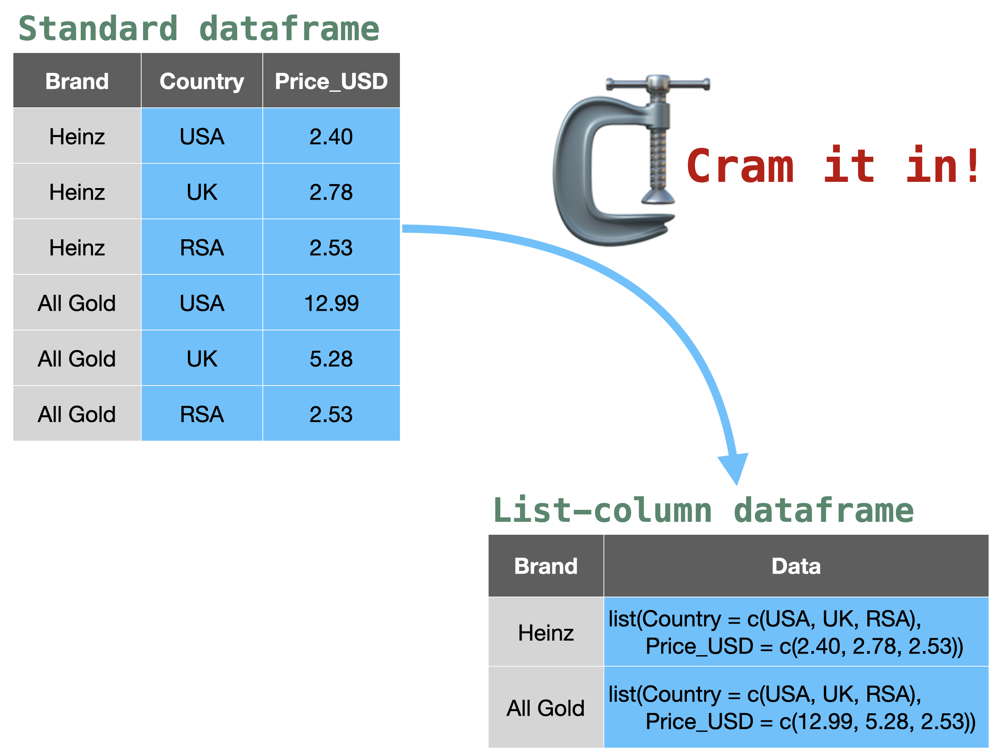

```{r include = FALSE}
# Set chunk options
knitr::opts_chunk$set(warning = FALSE,
                      message = FALSE,
                      fig.align = 'center')
```

****

I often find myself having to generate a multitude of exploratory plots and tables when I first lay my hands on a new dataset. This post describes one of the processes I sometimes go through to explore data using the _purrr_ package to work with list-columns within nested dataframes.

### Get some data

To start we need some data. I will be using **carrots** data from the _carrots_ data package (`devtools::install_github("kamermanpr/carrots")`). The _carrots_ package contains data on, you guessed it, carrots. The dataset, which is a pared-down version of a larger **carrots** dataset from the _lmerTest_ package, is briefly described in the figure and printouts below.

<br>
<div style="margin:auto;width:80%;">

</div>
<br>

```{r}
# Install package if not already installed
if('carrots' %in% installed.packages()[, "Package"] == FALSE){
    devtools::install_github("kamermanpr/carrots")
}

# Load the package
library(carrots)

# Load the data
data(carrots)

# Quick peek at the data
## Dimensions
dim(carrots)

## Structure
str(carrots)

## Summary
skimr::skim(carrots)
```

For this demonstration I only need some of the data, so I `m going to select the columns that I want (Product, Age_group, Preference, Crispness, Sweetness, Bitterness), and filter the carrot types (Product) so that I only have Bolero and Yukon carrots. 

```{r}
# Load required package
library(dplyr)

# Select columns and filter data
clean_carrots <- carrots %>% 
  select(Product, Age_group, Sex, 
         Preference, Crispness, 
         Sweetness, Bitterness) %>% 
  filter(Product %in% c('Bolero', 'Yukon'))
```

Crispness, sweetness, and bitterness are all attributes of the carrots and to my mind they should fall under a single attribute column. I can fix this problem using the `pivot_longer` function from the _tidyr_ package.

```{r}
# Load required packages
library(tidyr)

# Convert clean_carrots to long format
long_carrots <- clean_carrots %>% 
  pivot_longer(cols = c(Crispness, Sweetness, Bitterness),
               names_to = 'Attributes',
               values_to = 'Ratings')
```

Take a look at the new dataset.

```{r}
print(long_carrots)
```

### Working with list-columns

I think list-columns are great for rapidly analysing data across one or more grouping variables, while keeping intermediate and final outputs from an analysis nicely contained within a single dataframe.

For those of you unfamiliar with list-columns, they are columns in a dataframe that contain more than one piece of data per row within a column. Instead, each row of the column contain a list of two or more pieces of data. The figure below will hopefully give you some insight into what I mean by this description. Briefly, in the figure we have a standard dataframe with columns for brand of tomato sauce, country, and cost in each country. If we use brand of tomato sauce as a grouping variable, we can cram all the related data into one cell per row (note: it doesn't compress the data), replacing the previous two columns with a new list-column. That is, a column consisting a series of lists.

<br>
<div style="margin:auto;width:80%;">

</div>
<br>

The ultimate goal of this exploratory analysis is to look at the relationship between consumer carrot preference and carrot attributes (crispness, sweetness, and bitterness) for each carrot type according to age group. So, the first thing I need to do is to create a list-column of all the pieces of data with carrot type as a grouping variable.

Creating list-columns is simple with the help of the `group_by` function from the _dpylr_ package, and the `nest` function from the _tidyr_ package.

```{r}
# Create a dataframe with a list-column called 'data'
diced_carrots <- long_carrots %>% 
  # First group the data by carrot type
  group_by(Product) %>% 
  # Then 'nest' the remaining data into a list-column
  nest()
```

We now have a new dataframe with two columns, 'Product' and 'data'. 'Product' contains the grouping variable (carrot type), while 'data' contain the rest of the data as a list column.

If we compare the original dataframe with the nested dataframe they look like this:

**Original dataframe**

```{r}
print(long_carrots)
```

**Nested dataframe**

```{r}
print(diced_carrots)
```

If we look inside the two rows of the list-column, we find the data associated with each of the carrot types.

```{r}
print(diced_carrots$data)
```

### Working with list-columns

Because the 'data' column is a list of lists, you can iterate functions over the elements of the column using the _base R_ `lapply` function. However, I find the best way to work with dataframes that contain list-columns is to use the various `map` functions "(`map`, `map2`, `pmap` being the most basic varieties) from the _purrr_ package to iterate over the list-column rows. When combining one of the various `map` functions with the `mutate` function from the _dplyr_ package, you can take the output produced by applying a function over list-column(s) and place it into a new column in the same dataframe (see the figure below). This keeps all you analysis inputs and outputs together in one place. 

<br>
<div style="margin:auto;width:80%;">

</div>
<br>

First I will demonstrate a basic example of generating plots using `map`.

The `map` function takes one list (in this case a list-column from the dataframe) as an input and iterates a function over the data. As I've already said, when used within a _dplyr_ `mutate` function, the output from the `map` function is placed in a new column in the dataframe (as shown in the figure below).

<br>
<div style="margin:auto;width:80%;">

</div>
<br>

```{r}
# Load required packages
library(purrr)
library(ggplot2)

# Make a basic plot
diced_carrots <- diced_carrots %>% 
  # Add a new column containing ggplot objects
  mutate(basic_plot = map(.x = data, # Tell map to use the data found within the 'data' column
                          ~ ggplot(data = .x) + # Create a user-defined plotting function using the tilde
                            aes(x = Ratings,
                                y = Preference) +
                            geom_point(position = position_jitter(width = 0.2, 
                                                                  height = 0.2)) +
                            facet_wrap(~Attributes, nrow = 3) +
                            theme_bw(base_size = 14))) 
```

If you look at the resulting dataframe, it now has three columns, the grouping column (Product), the list-column (data), and a new list-column (basic_plot). This new column contains _ggplot_ plotting objects, one for each carrot type. 

```{r}
# Print the updated dataframe
print(diced_carrots)
```

Having the _ggplot_ objects in the dataframe is a bit useless unless theere is a way to print the plots. There are three functions that you can use to extract the plots from the list-column, the `lapply` function from _base R_, the `map` function from _purrr_, or the `walk` function from _purrr_. My personal choice is the `walk` function, which works exactly the same way `map` does, but it returns the input (.x) invisibly, thus making a cleaner output for RMarkdown documents. 

You will notice in the code below that for all three functions, the input is the column you want to apply the `print` function to, namely, _diced\_carrots$basic\_plot_.

```{r}
#-- Using lapply --#
# lapply(X = diced_carrots$basic_plot, FUN = function(x){print(x)})

#-- Using map --#
# map(.x = diced_carrots$basic_plot, ~ print(.x))

#-- Using walk --#
walk(.x = diced_carrots$basic_plot, ~ print(.x))
```

The problem with these figures is that you have no way of identifying which figure belongs to the the Bolero carrot, and which to the Yukon carrot. This is where we can use the `map2` function from _purrr_. The `map2` function works the same way as `map`, but can take two data inputs. And, like the `map` function, if we wrap the function with a `mutate` function, we can produce a new column in the dataframe (see the figure below).

<br>
<div style="margin:auto;width:80%;">

</div>
<br>

Our goal from with `map2` is to recapitulate the plots we had before, but with the carrot type as a plot title. We can do that by using the data from the 'data' list-column to draw the plot (as we did before), but then also using the data in the 'Product' column to label the plots.

```{r}
# Make a labeled plot
diced_carrots <- diced_carrots %>% 
  # Add a new column containing ggplot objects
  mutate(labeled_plot = map2(.x = data, # Tell map2 where to find the plotting data 
                             .y = Product, # Tell map2 where to find the label data
                          ~ ggplot(data = .x) + # Tell ggplot to use .x to draw the plots
                            aes(x = Ratings,
                                y = Preference) +
                            geom_point(position = position_jitter(width = 0.2, 
                                                                  height = 0.2)) +
                            labs(title = .y) + # Tell ggplot to use .y to add labels 
                            facet_wrap(~Attributes, nrow = 3) +
                            theme_bw(base_size = 14))) 

# Look at the resulting dataframe
print(diced_carrots)
```

The new column 'labeled_plot' is a list-column of ggplot objects, which we can then print using the `walk` function.

```{r}
# Print the new figures
walk(.x = diced_carrots$labeled_plot, ~print(.x))
```

We now have labeled figures, which makes identification easy.

To use more than two sources of data, you use `pmap` (see figure below). 

<br>
<div style="margin:auto;width:80%;">

</div>
<br>

There is a slight difference between `map/map2`, and`pmap` in terms of identifying the sources of data. Instead of using _.x_ and _.y_ to identify the data sources, you list the data sources using _.l_. For example:

```{r eval = FALSE}
# A list
pmap(.l = list(data_1, data_2, data_3, ...), ...)

# Or a named list
pmap(.l = list(foo = data_1, bar = data_2, baz = data_3, ...), ...)
```

When calling the data within your function, you can either use the positions in the list using _..1_, _..2_, _..3_, _etc_ for the first, second, third, etc items in the list. Or, if you have a named list, you can use call the data using the names. In the example above, that would be, _foo_, _bar_, _baz_, _etc_. 

I will use `pmap` to add a line to my plots showing what the median preference rating is, but I want to do this procedure for a slightly more complex plot that the ones I have used before, which were only faceted by carrot taste attribute. Now I want to faceting the figure by taste attribute and age group to see whether there is a change in the relationship between carrot taste attributes and carrot preference as one gets older.

I would usually use the `stat_summary` function in _ggplot_ to add a summary measure to a plot, but it is my experience in _ggplot_ that `geom_hline` does not play nicely within `stat_summary`, and so the first step in adding the median rating to each plot facet is to create a new dataframe with median preference value for each carrot type according to age group and taste attribute. This can be done using the `map` function, along with the `group_by` and `summarise` functions from _dplyr_. 

```{r}
# Calculate the median preference rating for each carrot type according 
# to and age group and taste attribute
diced_carrots <- diced_carrots %>% 
  mutate(median_pref = map(.x = data, # Tell map where to find the data to summarise
                           ~ .x %>% 
                             group_by(Age_group, Attributes) %>%
                             summarise(med_ian = round(median(Preference, 
                                                              na.rm = TRUE)))))

# Print the updated dataframe
print(diced_carrots)
```

The new column is a list-column of dataframes (tibbles), and we can look at the contents of the new column using `walk` or `walk2`. `walk2` behaves the same way as `walk` but takes two inputs (like its sibling `map2`), and allows one to produce pretty, labeled tables using the `kable` function from the _knitr_ package (if you are knitting an Rmarkdown document, remember to put `results = 'asis'` in the chunk options when printing `kable` tables).

```{r results = 'asis'}
# Print the dataframes
walk2(.x = diced_carrots$median_pref, # Tell walk2 where to find the dataframes to print as tables
      .y = diced_carrots$Product, # Tell walk2 where to find the labels for table captions 
      ~ print(knitr::kable(x = .x,
                           caption = .y)))
```

Now that I have the summarised data, I can create the new plots using `pmap` to pull in data from three (or more if required) sources. One source for the basic plots, one source for adding the median preference data, and one source to label the plots. 

```{r}
diced_carrots <- diced_carrots %>% 
  # Add a new column containing ggplot objects
  mutate(labeled_plot2 = pmap(.l = list(data, median_pref, Product), # Tell pmap where to find the data 
                          ~ ggplot(data = ..1) + # Tell ggplot to use ..1 to draw the basic plots
                            aes(x = Ratings,
                                y = Preference) +
                            geom_point(position = position_jitter(width = 0.2, 
                                                                  height = 0.2)) +
                            geom_hline(data = ..2, # tell ggplot to use ..2 to draw the median values
                                       aes(yintercept = med_ian), 
                                       colour = 'red') +
                            labs(title = ..3) + # Tell ggplot to use ..3 to add labels 
                            facet_grid(Attributes ~ Age_group) +
                            theme_bw(base_size = 14))) 

# Look at the resulting dataframe
print(diced_carrots)

# Print the figures
walk(.x = diced_carrots$labeled_plot2, ~print(.x))
```

And there you have it, a neat and tidy way of generating exploratory plots and tables. I've used this process on some fairly large datasets and it seems to scale nicely.

****

# Session information

```{r echo = FALSE}
sessionInfo()
```
