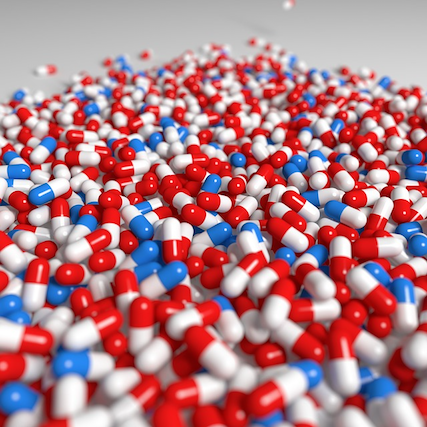

{ style="float:left;margin-left:auto;margin-right:auto;padding:16px 16px 20px 0px;" width=200px }

### Too few medicines to treat neuropathic pain on national essential medicines lists

**Peter Kamerman**

_11 February 2017_

An interactive map of which medicines recommended for the treatment of neuropathic pain are listed on national essential medicines lists.

<a class="btn btn-primary" href="http://painblogr.org/2017-02-11-eml-drug-map.html" target="_blank">Read more <i class="fa fa-arrow-circle-o-right fa-2x" style="vertical-align: middle;" aria-hidden="true"></i></a>

****

{ style="float:left;margin-left:auto;margin-right:auto;padding:16px 16px 100px 0px;" width=200px }

### From epub to print copy, which of the traditional 'pain' journals is the quickest?

**Peter Kamerman**

_5 February 2017_

How quickly do the top four pain-specific journals convert from _epub ahead of print_ to _print copy_? I present a very rough-and-ready analysis for the journals: <a href="http://journals.lww.com/clinicalpain/pages/default.aspx" target="_blank">Clinical Journal of Pain</a>, <a href="http://onlinelibrary.wiley.com/journal/10.1002/(ISSN)1532-2149" target="_blank">European Journal of Pain</a>, <a href="http://www.jpain.org/home" target="_blank">Journal of Pain</a>, and <a href="http://journals.lww.com/pain/pages/default.aspx" target="_blank">PAIN</a>.

<a class="btn btn-primary" href="http://painblogr.org/2017-02-05-publication-time.html" target="_blank">Read more <i class="fa fa-arrow-circle-o-right fa-2x" style="vertical-align: middle;" aria-hidden="true"></i></a>
