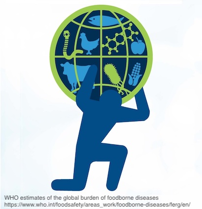

 

{ style="float:left;margin-left:auto;margin-right:auto;padding:16px 16px 20px 0px;" width=200px }

### Arthritic pain in the USA

**Peter Kamerman**

_9 March 2019_

I analysed Global Burden of Disease data to see whether our increasing life expectancy over the past three decades is extra time spent in good health or poor health.

<a class="btn btn-primary" href="https://www.painblogr.org/2019-03-09-pain-in-the-usa.html" target="_blank">Read more <i class="fa fa-arrow-circle-o-right fa-2x" style="vertical-align: middle;" aria-hidden="true"></i></a> 

****

{ style="float:left;margin-left:auto;margin-right:auto;padding:16px 16px 20px 0px;" width=200px }

### When your ‘golden years’ are not so golden

**Peter Kamerman**

_25 January 2019_

I analysed Global Burden of Disease data to see whether our increasing life expectancy over the past three decades is extra time spent in good health or poor health.

<a class="btn btn-primary" href="https://www.painblogr.org/2019-01-25-global-burden-of-disease.html" target="_blank">Read more <i class="fa fa-arrow-circle-o-right fa-2x" style="vertical-align: middle;" aria-hidden="true"></i></a> 

