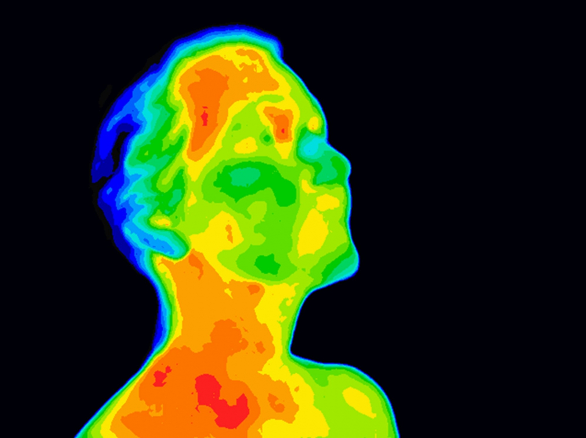

 

{ style="float:left;margin-left:auto;margin-right:auto;padding:16px 16px 20px 0px;" width=200px }

### So you think investing in fever screening can curb the spread of COVID-19? Think again

**Andrea Fuller** and **Duncan Mitchell**

_14 June 2020_

An article that discusses the futility of using fever screening for COVID-19 infection.

<a class="btn btn-primary" href="https://www.painblogr.org/2020-06-14-covid-fevers.html" target="_blank">Read more <i class="fa fa-arrow-circle-o-right fa-2x" style="vertical-align: middle;" aria-hidden="true"></i></a> 

****

 

{ style="float:left;margin-left:auto;margin-right:auto;padding:16px 16px 20px 0px;" width=200px }

### COVID-19 in South Africa

**Peter Kamerman**

_15 March 2020_

A website that gives daily updates on the state of COVID-19 cases and deaths in South Africa.

<a class="btn btn-primary" href="https://covid19za.netlify.com/" target="_blank">Read more <i class="fa fa-arrow-circle-o-right fa-2x" style="vertical-align: middle;" aria-hidden="true"></i></a> 

****

 

{ style="float:left;margin-left:auto;margin-right:auto;padding:16px 16px 20px 0px;" width=200px }

### Arthritis in the USA

**Peter Kamerman**

_9 March 2019_

Using the `survey` package to analyse data on athritis from the 2013 US Behavioral Risk Factor Surveillance System (BRFSS) survey.

<a class="btn btn-primary" href="https://www.painblogr.org/2019-03-09-pain-in-the-usa.html" target="_blank">Read more <i class="fa fa-arrow-circle-o-right fa-2x" style="vertical-align: middle;" aria-hidden="true"></i></a> 
